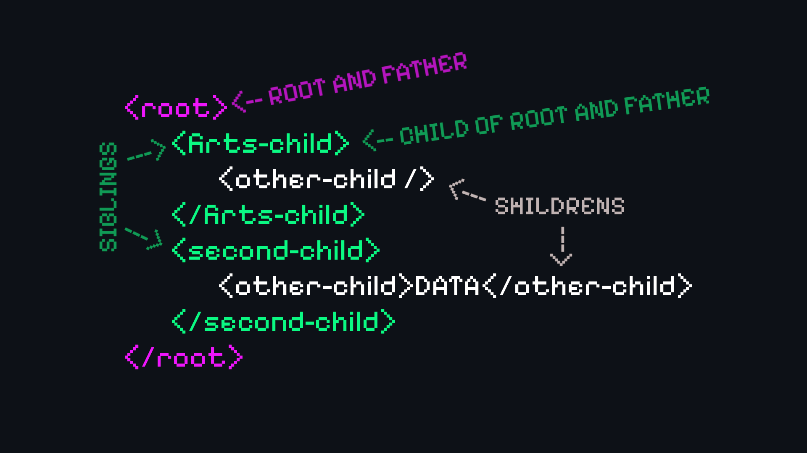

# XML
XML o eXtensible Markup Language es un lenguaje de marcado estructurado, pensado para el traspaso de información de un sistema a otro. Pensado para ser legible por humanos y maquinas, siendo en aspecto, bastante parecido a HTML.

## Características de XML
Algunas de las características principales de XML son:
* Es un lenguaje de marcas.
* Esta pensado para ser auto-descriptivo.
* Independencia del software y hardware ➡️ Al ser íntegramente texto plano.
* No tiene etiquetas pre-definidas ➡️ Tu creas las etiquetas.
* Es extensible ➡️ Puedes eliminar o añadir información sin romper el programa
* Es un estándar recomendado por w3c $*^1$.
* Separa la información de la presentación ➡️ XML no da datos sobre la presentación. Junto a JS puedes crear contenido que cambie con la información de un XML. Ejem.: Actividad de los Simpsons
* Utiliza una estructura de Árbol.
* Todas las etiquetas deben tener una de abertura y una de cierre. Las auto-cerradas también deben cerrarse. Ejem.: ``.
* Los espacios de los valores no se colapsan como en HTML.

> $*^1$ [Documentación w3c](https://www.w3.org/TR/xml/), [Recurso w3c](https://www.w3.org/XML/) y [XML en 10 puntos](https://www.w3.org/XML/1999/XML-in-10-points.es.html)

## Estructura de Árbol
Todo documento XML tiene un elemento raíz o root. Dentro se almacenarán los demás elementos que contenga el archivo XML.

Puedes anidar tantos elementos como veas necesario. Y es hay donde entra la estructura de árbol, donde un elemento padre es quien agrupa un elemento, siendo este último llamado hijo. Los elementos que se mantienen en el mismo nivel se denominan elementos hermanos.



Por lo que, en todos los archivos XML existirá un elemento raíz, el cual, será el padre de resto de elementos, y a partir de esos hijos se crearan otros hijos, en caso de ser necesario, que almacenarán los datos.

```
<root>
  <child>
    <subChild>
        <subSubChild> Datos </subSubChild>
        <siblingOfSubSubChild> Datos </siblingOfSubSubChild>
    </subChild>
    <siblingOfSubChild> Datos </siblingOfSubChild>
  </child>
  <siblingOfChild> Datos <siblingOfChild>
</root>
```

## Los elementos
Los elementos en XML son las 'etiquetas' de HTML. No existen predefinidas, si no que tu creas las tuyas siguiendo unas normas básicas para evitar errores. Todas las etiquetas pueden almacenar datos y atributos o una mezcla de ambas.

* Todas las etiquetas tienen que tener una de apertura y una de cierre ➡️ `<p>Parágrafo</p>` o `<br />`
* Los valores de los atributos siempre van entrecomillados ➡️ `<br atributo="valor" />`, con comillas dobles o simples
* Los nombres son sensibles a minúsculas y mayúsculas ➡️ `<br \> != <BR \>`
* Hay que mantener un buen anidado

| Anidado Correcto | Mal Anidado |
| -- | -- |
| `<x><i><\i><\x>` | `<x><i><\x><\i>` |

Las normas para declarar los nombres de los elementos:
* Tienen que empezar por letra o `_`.
* El único patron de caracteres reservado es xml, tanto en minúsculas como en mayúsculas.
* Pueden contener letras, números, `-`, `_` y `.` ➡️ Estos tres últimos no son recomendables usarlos, al igual que las letras fuera del alfabeto ingles.
* No pueden contener espacios.

No existe ninguna convención para nombrar los elementos, pero se suele utilizar la misma que en la base de datos relacionada al documento, si tiene.

### Caracteres problemáticos
Dentro de los elementos podemos guardar datos, estos datos pueden contener caracteres problemáticos. Estos caracteres son `<` y `&`, pero también pueden causar problemas `>`, `'` o `"`. Es por eso que se sustituyen con los siguiente códigos.

| Elemento | Código |
| - | - |
| `<` | `&lt;` |
| `>` | `&gt;` |
| `&` | `&amp;` |
| `'` | `&apos;` |
| `"` | `&quot;` |

Aparte para evitar errores con los caracteres que utilices puedes añadir al principio del documento un prologo, el cual, es opcional, pero de existir tienen que ir al principio del documento, y solo indica la versión de XML y el juego de caracteres utilizado, por defecto es UTF-8.

> `<?xml version="1.0" encoding="UTF-8"?>`

### Atributos
Contienen información de un elemento en concreto. 

Se caracterizan por:
* No pueden contener multiples valores.
* Se pierda la estructura en árbol.
* No son fácilmente extensibles.
* Se pueden utilizar para identificar a un elemento en concreto por un ID.

# Diferencia entre HTML y XHTML
HTML 5 tiene dos variantes; HTML y XHTML, las dos son formas de describir el contenido de página, pero contienen diferencias sintácticas. Mientras que HTML esta basado en la normal SGML $*^1$, XML esta basado en XML. Siendo que XHTML es más restrictivo en su sintaxis que HTML.

> $*^1$ [Standard Generalized Markup Language](https://es.wikipedia.org/wiki/SGML)

Por lo que, XHTML tienen que seguir las normas ya mencionadas en este documento. Un documento XHTML que no las siga será por tanto un documento invalido. Y dependiendo de como se envíen al navegador; `application/xhtml+xml` o `text/html`, el navegador rechazara o intentará interpretar las. Como te podrás imaginar, `application/xhtml+xml` se utiliza para XHTML y `text/html` para HTML. 